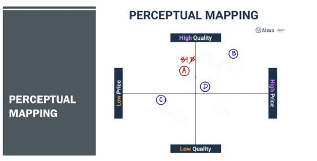
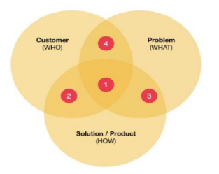
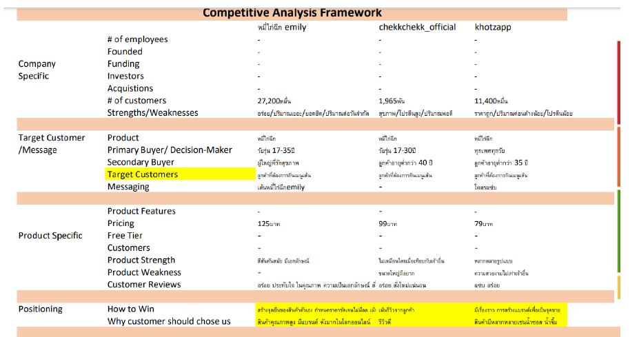
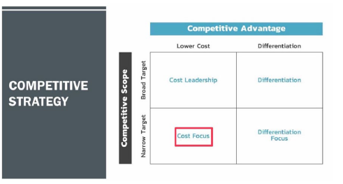

# Supply Chain Analysis for E-Commerce Business

# การวิเคราะห์ E-Commerce Supply Chain — ล้ำเสน LUMZEN หมี่ไก่ฉีก


---

## ภาพรวมโปรเจค

โปรเจคนี้เป็นการวิเคราะห์ **E-Commerce Supply Chain** ของผลิตภัณฑ์ **ล้ำเสน LUMZEN หมี่ไก่ฉีก** ในฐานะ **Manufacturer** โดยครอบคลุมตั้งแต่การวิเคราะห์ความต้องการของผู้บริโภค การวิเคราะห์คู่แข่ง กระบวนการผลิต ไปจนถึงการทำ Facebook Ads จริงและวิเคราะห์ผล KPI

---

## สารบัญเนื้อหา

1. [การวิเคราะห์ด้านความต้องการ (Demand Side)](#1-การวิเคราะห์ด้านความต้องการ-demand-side)
2. [การวิเคราะห์คู่แข่ง (Competition)](#2-การวิเคราะห์คู่แข่ง-competition)
3. [กลยุทธ์การแข่งขัน (Competitive Strategy)](#3-กลยุทธ์การแข่งขัน)
4. [โครงสร้างราคาและโปรโมชั่น (Pricing & Promotion)](#4-โครงสร้างราคาและโปรโมชั่น)
5. [การวิเคราะห์ด้านอุปทาน (Supply Side)](#5-การวิเคราะห์ด้านอุปทาน-supply-side)
6. [Content และการตลาดออนไลน์](#6-content-และการตลาดออนไลน์)
7. [Facebook Ads & KPI Analysis](#7-facebook-ads--kpi-analysis)

---

## 1. การวิเคราะห์ด้านความต้องการ (Demand Side)

### ทฤษฎีมาสโลว์ (Maslow's Hierarchy)

วิเคราะห์ความต้องการของผู้บริโภคต่อผลิตภัณฑ์หมี่ไก่ฉีก ใน 2 ระดับ

| ระดับ | รายละเอียด |
|---|---|
| **Physiological Need** | ให้คาร์โบไฮเดรต โปรตีนจากไก่ วิตามินและเกลือแร่จากผัก |
| **Social Need** | รับประทานง่าย สะดวก เหมาะทุกโอกาส ซื้อเป็นของฝากได้ |

### Pain Point Analysis (AVATAR Technique)

| ปัจจัย | รายละเอียด |
|---|---|
| เพศ / อายุ | ชาย-หญิง, 18–30 ปี |
| อาชีพ | นักศึกษา, พนักงานบริษัท |
| รายได้ | 20,000 บาทขึ้นไป |
| ที่อยู่ | กรุงเทพมหานคร |
| Lifestyle | คนชอบเมนูเส้น, ใช้ Grab / LINE MAN |
| จุดเด่นของสินคา | อร่อย ปริมาณมาก บรรจุภัณฑ์ดี ราคาคุ้มค่า |

### ลักษณะความต้องการ: **Trend**

หมี่ไก่ฉีกเป็นเมนูที่เติบโตตาม **เทรนด์อาหารสุขภาพ** เนื่องจาก:
- ตอบโจทย์สุขภาพ: โปรตีนสูง แคลอรีอยู่ที่ 350–380 Kcal
- ปรับรสชาติได้หลากหลาย (เผ็ด / ไม่เผ็ด)
- รับประทานง่าย เหมาะกับ Lifestyle เร่งรีบ
- ดัดแปลงส่วนผสมได้ตามต้องการ

---

## 2. การวิเคราะห์คู่แข่ง (Competition)

### Perceptual Mapping

เปรียบเทียบ 4 แบรนด์ในแกน **ราคา vs คุณภาพ**



| แบรนด์ | ราคา | ตำแหน่ง |
|---|---|---|
| **A — ล้ำเสน LUMZEN** | 89 บาท | Low Price / High Quality ✅ |
| B — Emily's | 125 บาท | High Price / High Quality |
| C — อาริว ศรียาน | 85 บาท | Low Price / Low Quality |
| D — แมวกินหมี่ | 90 บาท | High Price / Low-Mid Quality |

> ล้ำเสน LUMZEN อยู่ในจุดที่ดีที่สุด: **คุณภาพสูง ราคาย่อมเยา**

### SWOT Analysis

| | รายละเอียด |
|---|---|
| **Strengths** | รสชาติดี ราคาย่อมเยา ปริมาณมาก คุณค่าโภชนาการดี |
| **Weaknesses** | อายุการเก็บรักษาสั้น มีรสชาติเดียว |
| **Opportunities** | เทรนด์สุขภาพ, ช่องทางออนไลน์เพิ่มขึ้น, ตลาดอาหารด่วน |
| **Threats** | การแข่งขันในตลาดสูง |

### Who-What-How Framework



| ประเภทคู่แข่ง | Customer | Problem | Solution |
|---|---|---|---|
| Direct Competition | วัยรุ่น / คนรักสุขภาพ | ควบคุมแคลอรี่ | หมี่ไก่ฉีก |
| Different Problem | วัยรุ่น / คนรักสุขภาพ | ยังไม่รู้จักแบรนด์ | หมี่ไก่ฉีก |
| Different Customer | อายุต่ำกว่า 28 ปี | ควบคุมแคลอรี่ | หมี่ไก่ฉีก |
| Different Solution | วัยรุ่น / คนรักสุขภาพ | ควบคุมแคลอรี่ | รูปแบบ Product / การตลาดออนไลน์ |

### Competitive Analysis Framework (3 คู่แข่งหลัก)




---

## 3. กลยุทธ์การแข่งขัน

### Competitive Strategy: **Cost Focus**



มุ่งเน้นกลุ่มลูกค้าที่ **รักสุขภาพและต้องการอาหารราคาประหยัด** โดยยึดตำแหน่ง *Low Cost + Narrow Target* ในกรอบ Porter's Generic Strategy

---

## 4. โครงสร้างราคาและโปรโมชั่น

### Pricing Structure

#### แบบที่ 1 — PUSH Strategy

| รายการ | มูลค่า (บาท) |
|---|---|
| ราคาปลีก | 89 |
| กำไร | 30 |
| ค่าส่ง | 10 |
| ค่า Ads | 20 |
| VAT 7% | 6.23 |
| **ราคาต้นทุนสินค้า** | **22.77** |

#### แบบที่ 2 — PULL Strategy

| รายการ | มูลค่า (บาท) |
|---|---|
| ราคาปลีก | 89 (หรือ 95.23 รวม VAT) |
| ต้นทุนสินค้า | 29 |

### แผนโปรโมชั่น

| โปรโมชั่น | ช่วงเวลา | รายละเอียด |
|---|---|---|
| เปิดตัวเมนูใหม่ | เดือนแรก | ลด 10–15% หรือเซ็ตคู่เครื่องดื่ม |
| Weekday Special | จ–พฤ, 14:00–17:00 น. | รับส่วนลด 20% ครั้งถัดไป |
| Family Set | วันหยุดสุดสัปดาห์ | ซื้อ 3 แถม 1 หรือส่วนลด 25% |
| เทศกาล | ปีใหม่ / สงกรานต์ | ชุดพิเศษราคาลดพิเศษ |
| สะสมแต้ม | ตลอดปี | ครบ X จาน รับฟรี 1 จาน |
| Delivery Platform | ตลอดเดือน | ลด 10–15% เมื่อสั่งผ่าน App |

---

## 5. การวิเคราะห์ด้านอุปทาน (Supply Side)

### Bill of Materials (BOM)

| # | ส่วนประกอบ | ปริมาณ | หน่วย |
|---|---|---|---|
| 1 | เนื้ออกไก่ | 15 | กรัม |
| 2 | เส้นหมี่ขาว | 170 | กรัม |
| 3 | ผักคอส | 10 | กรัม |
| 4 | กากหมู | 5 | กรัม |
| 5 | กระเทียมเจียว | 3 | กรัม |
| 6 | น้ำซอส | 10 | กรัม |
| 7 | กล่องบรรจุภัณฑ์ | 1 | กล่อง |

### Process Flow Chart

```
เริ่มต้น
   │
   ▼
จัดเตรียมวัตถุดิบ
   │
   ├──► แช่เส้นหมี่
   ├──► ล้างผัก
   └──► ต้มอกไก่ ──► ฉีกอกไก่
   │
   ▼
เจียวกระเทียม
   │
   ▼
นำเส้นหมี่มาคลุกน้ำซอส
   │
   ▼
บรรจุลงในกล่อง
   │
   ▼
ชิมรสชาติและตรวจสอบ
   │
   ├── ไม่ผ่าน ──► (กลับไปปรับ)
   └── ผ่าน
        │
        ▼
   ส่งให้ลูกค้า ──► สิ้นสุด
```

### In-house vs Outsourcing

| ส่วนประกอบ | In-house | Outsourcing | เหตุผล |
|---|---|---|---|
| เนื้ออกไก่ | | ✅ | ลดต้นทุนจัดการเนื้อสด |
| เส้นหมี่ขาว | | ✅ | ราคาต่ำ ลดภาระการผลิต |
| ผักคอส | | ✅ | ได้ผักสดจากแหล่งที่เชื่อถือได้ |
| กากหมู | | ✅ | ลดขั้นตอนทอด ควบคุมคุณภาพ |
| กระเทียมเจียว | ✅ | | ควบคุมคุณภาพและความหอมสด |
| น้ำซอส | | ✅ | รสชาติสม่ำเสมอ |
| กล่องบรรจุภัณฑ์ | | ✅ ([1688.com](https://detail.1688.com/offer/691257432973.html)) | มาตรฐานดี |

---

## 6. Content และการตลาดออนไลน์

### Brand Identity

| องค์ประกอบ | รายละเอียด |
|---|---|
| **สีหลัก** | ⬜ สีขาว — ความสะอาด สดใหม่ สุขภาพดี |
| **สีรอง** | 🟧 สีส้ม — ความอบอุ่น กระตุ้นความอยากอาหาร ทันสมัย |
| **แนวคิด** | อาหารสุขภาพ ราคาเข้าถึงได้ เน้นคุณค่าโภชนาการ |

### 3 โพสต์หลัก (Facebook Page: ล้ำเสน Lumzen)

| โพสต์ | แนวคิด | Insight |
|---|---|---|
| **โพสต์ที่ 1** | ประชาสัมพันธ์ Delivery ผ่าน LINE MAN ราคา 89 บาท | เน้นความใส่ใจ + ลิงก์สั่งซื้อทันที |
| **โพสต์ที่ 2** | รูปอาหารและบรรจุภัณฑ์ที่น่ารับประทาน | กระตุ้นด้วยภาพคุณภาพ + USP เส้นเหนียวนุ่ม ไก่ฉีกชิ้นใหญ่ |
| **โพสต์ที่ 3** | รายละเอียดส่วนผสม + แคลอรี 350–380 Kcal | เจาะกลุ่มคนรักสุขภาพ ด้วยข้อมูลโภชนาการชัดเจน |

### 3 กลุ่มเป้าหมาย

| กลุ่ม | เพศ / อายุ | ความสนใจหลัก |
|---|---|---|
| กลุ่มที่ 1 | ชาย-หญิง อายุ 20–25 ปี | ตามเทรนด์, ชอบกินเส้น |
| กลุ่มที่ 2 | ชาย-หญิง อายุ 25–30 ปี | ราคาและปริมาณ |
| กลุ่มที่ 3 | ชาย-หญิง อายุ 30–35 ปี | สุขภาพและโภชนาการ |

---

## 7. Facebook Ads & KPI Analysis

### แคมเปญที่ 1 — ล้ำเสนหมี่ไก่ฉีก (1 Campaign · 3 Ad Sets · 3 Ads)

| กลุ่มเป้าหมาย | Impressions | CPM (฿) | Clicks | CPC (฿) | CTR (%) |
|---|---|---|---|---|---|
| ชาย-หญิง 30–35 ปี | 456 | 191.36 | 4 | 21.82 | **0.88%** ⬆️ |
| ชาย-หญิง 25–30 ปี | 534 | 195.21 | 2 | 52.12 | 0.37% |
| ชาย-หญิง 20–25 ปี | 367 | 242.15 | 2 | 44.44 | 0.54% |
| **รวม** | **1,357** | **206.61** | **8** | **35.05** | **0.59%** |

> **Insight:** กลุ่ม 30–35 ปี มี CTR สูงสุด (0.88%) และ CPC ต่ำสุด (฿21.82) — เหมาะแก่การ Scale Budget

### แคมเปญที่ 2 — ล้ำเสน 2 (Broad Targeting)

| กลุ่มเป้าหมาย | ผลลัพธ์ | การเข้าถึง | Impressions |
|---|---|---|---|
| ชาย-หญิง 40–50 ปี (ท่องเที่ยว) | — | 284 | 301 |
| ชาย-หญิง 35–40 ปี (อาหาร) | 1 | 336 | 348 |
| ชาย-หญิง 20–25 ปี (ยิงหวาน) | — | 334 | 350 |
| **รวม** | **1** | **999** | **1,357** |

### เปรียบเทียบ 2 แคมเปญ

| ตัวชี้วัด | ล้ำเสนหมี่ไก่ฉีก | ล้ำเสน 2 | ผลลัพธ์ |
|---|---|---|---|
| Reach | 1,148 | 939 | ✅ ล้ำเสนหมี่ไก่ฉีกดีกว่า |
| Impressions | 1,357 | 999 | ✅ ล้ำเสนหมี่ไก่ฉีกดีกว่า |
| CPM | ฿206.61 | ฿187.10 | ➖ ใกล้เคียงกัน |
| CPC | **฿35.05** | ฿93.46 | ✅ ล้ำเสนหมี่ไก่ฉีกถูกกว่ามาก |
| CTR | **0.59%** | 0.20% | ✅ ล้ำเสนหมี่ไก่ฉีกดีกว่า 3x |
| Total Clicks | **8** | 2 | ✅ ล้ำเสนหมี่ไก่ฉีกดีกว่า |

### สรุปและข้อเสนอแนะ

- แคมเปญ **ล้ำเสนหมี่ไก่ฉีก** มีประสิทธิภาพโดยรวมสูงกว่าในทุกด้าน
- ควร **Scale Budget** ในกลุ่ม 30–35 ปี ที่มี CTR สูงและ CPC ต่ำที่สุด
- ปรับ Content ของแคมเปญ "ล้ำเสน 2" ให้ดึงดูดมากขึ้น เพื่อเพิ่ม CTR จาก 0.20%
- กลุ่ม 25–30 ปี มี CPC สูง (฿52.12) → ควรทดสอบ Creative ใหม่เพื่อลดต้นทุน

---


